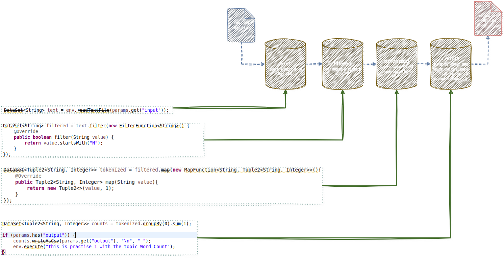
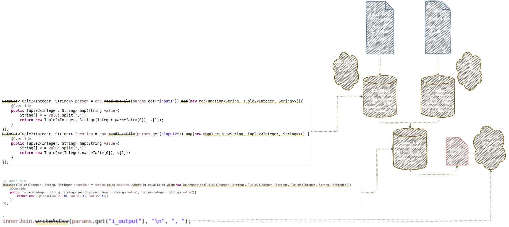

# Flink Basics

## Word Count Program

This Word Count program is built using Apache Flink and processes text data to count the number of words that start with the letter "N". It reads input from a file, splits the lines into individual words, filters for those starting with "N", and aggregates their counts. The result is a list of matching words along with how many times they appeared. This demonstrates Flink's ability to handle simple yet powerful data transformations in a distributed environment.

### input/output

| input file [input.txt](../files/input.txt) | output file [output.txt](../files/output.txt) |
| ------------------------------------------ | --------------------------------------------- |
| Noman                                      | Nana 2                                        |
| Joyce                                      | Nanaho 2                                      |
| Noman                                      | Nate 1                                        |
| Sayuri                                     | Nicole 7                                      |
| Frances                                    | Nipul 6                                       |
| .                                          | .                                             |
| .                                          | .                                             |

### Program flowchart

### Jar File

link: [Download JAR](../jar_files/wordCount_example.jar)

## command to run the jar file (program)

**WC run command:** 
flink run ~/Desktop/DataSet/wordCount_example.jar --input file:///home/a/Desktop/DataSet/input.txt --output file:///home/a/Desktop/DataSet/output.txt

---

## Join Program

This Apache Flink program reads two input files: person.txt containing person IDs and names, and location.txt containing IDs and locations. It performs three types of join operations—inner join, left outer join, and full outer join—based on matching IDs. The inner join returns records with matching IDs in both files, the left outer join includes all persons and adds location data if available, and the full outer join combines all records from both files, inserting null where no match exists. This demonstrates how Flink handles relational-style joins in a distributed data processing environment.

### input

| [person.txt](../files/person.txt) | [location.txt](../files/location.txt) |
| --------------------------------- | ------------------------------------- |
| 1,John                            | 1,DC                                  |
| 2,Albert                          | 2,NY                                  |
| 3,Lui                             | 4,LA                                  |
| .                                 | .                                     |
| .                                 | .                                     |

### output

| [innerJoin.txt](../files/person.txt) | [person.txt](../files/person.txt) | [person.txt](../files/person.txt) |
| ------------------------------------ | --------------------------------- | --------------------------------- |
| 1, John, DC                          | 1, John, DC                       | 1, John, DC                       |
| 2, Albert, NY                        | 2, Albert, NY                     | 1, Mohammed, DC                   |
| 4, Smith, LA                         | 3, Lui, Null                      | 6, Null, LU                       |
| .                                    | .                                 | .                                 |
| .                                    | .                                 | .                                 |

### Program flowchart

### JarFile: link: [Download JAR](../jar_files/J_example.jar)

## command to run the jar file (program)

**Join run command:** 
flink run ~/Desktop/DataSet/J_example.jar --input1 file:///home/a/Desktop/DataSet/person.txt --input2 file:///home/a/Desktop/DataSet/location.txt --i_output file:///home/a/Desktop/DataSet/innerJoin.txt --l_output file:///home/a/Desktop/DataSet/leftJoin.txt --r_output file:///home/a/Desktop/DataSet/rightJoin.txt

## Word Count Streaming Program
This streaming Word Count program uses Apache Flink to process live text data from port 9999. It filters words starting with "N" and continuously updates their counts in real-time, demonstrating Flink’s streaming and stateful processing capabilities.

## input/ Output

| input (listening on the port 9999 for stream data) | output file [wc_stream.txt](../files/streaming/wc_streaming_output.txt) |
| ------------------------------------------ | --------------------------------------------- |
| Ni                                         | (Ni,1)                                        |
| Noman                                      | (Noman,1)                                     |
| Noman                                      | (Noman,2)                                     |
| Nickle                                     | (Nickle,1)                                    |
| Nickle                                     | (Nickle,2)                                    |
| .                                          | .                                             |
| .                                          | .                                             |

## program flowchart

## Jar File

link: [Download JAR](../jar_files/WordCount_streaming.jar)